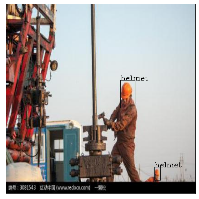

Usage
*****

.. _installation:

Installation
============

To use imgann, you could install using `PyPi <https://pypi.org/project/imgann/>`_ :

.. code-block:: console

   (.venv) $ pip install imgann

Another option is to directly build the library from codebase :

.. code-block:: console

   % clone codebase
   $ git clone https://github.com/nipdep/imgann.git
   % for usual usage
   $ pip install -e .
   % for development 
   $ pip install -e .[dev]

Functionalities
===============

Annotated Dataset Preview
--------------------------

It's import to make sure downloaded dataset image annotations are in proper / precise manner, And after all it's good to check the resulting annotations after custom annotation type conversion or 
annotation conversion provided by this library.

The following view function work in both *python* and *IPython* kernels. but ew encourage you to use in interactive python environment such as Jupyter notebooks.
Also, dataset and annotation file paths could be in either relative or absolute formats. This function generates set or pseudo random images with their
bounding + label on. Also, you could define resulting image shape and the seed to get consistent image outputs.

.. note::
   The `image-shape` does not change the aspect ratio of the images in the dataset at any point.
   More explicitly, For example let say the images shape of original dataset is (246, 246); means the aspect ration of 1:1.
   So, even you have input image_shape=(400, 500) the resulting image in the shape (400,400) to preserve original aspect ratio. 

.. autofunction:: imgann.show_samples

Code Example:

.. code-block:: python

   from imgann import Sample
   Sample.show_samples(data_path='../data/Hard Hat Sample.v5.voc/test', 
                       ann_path='../data/Hard Hat Sample.v5.voc/test', 
                       num_of_samples=5, 
                       ann_type='voc', 
                       seed=123, 
                       image_shape=[500, 500])

*Sample Output*

.. note::
   For further instruction follow to API page.

Convert Annotation Format
-------------------------

The library support converting between PascalVOC, COCO and CSV. In General, all the functions take parameter as image dataset directory and annotation file directory.

.. data:: COCO to PascalVOC

.. note:: 

   | the parameter 'center' defines the bounding box define formats;
   | [X_center, Y_center, Width, Heigth] < if center=True 
   | [X_min, Y_min, Width, Heigth] < if center=False. i.e. `roboflow <https://app.roboflow.com/>`_ annotated .json files saved in this format.

.. autofunction:: imgann.coco2voc

Code Example:

.. code-block:: python

   from imgann import Convertor
   Convertor.coco2voc(dataset_dir='../data/Hard Hat Sample.v5i.coco/test',
                      coco_ann_dir='../data/Hard Hat Sample.v5i.coco/test/_annotations.coco.json',
                      save_dir='../data/coco2voc)

.. data:: COCO to CSV

.. note::

   | The library supports two CSV formats as the output.
   | The first format is directly applicable with any object detection work. hence the result contains bounding boxes.
   | In the second format it contains only number of distinct class contains in each image; which format directly supports to multi-class multi-label classification task.

Code Example:

.. code-block:: python

   from imgann import Convertor
   Convertor.coco2csv(dataset_dir='../data/Hard Hat Sample.v5i.coco/test',
                      coco_ann_dir='../data/Hard Hat Sample.v5i.coco/test/_annotations.coco.json',
                      save_dir='../data/coco2csv.csv')

.. data:: PascalVOC to COCO

Code Example:

.. code-block:: python

   from imgann import Convertor
   Convertor.voc2coco(dataset_dir='../data/Hard Hat Sample.v5i.coco/test',
                      voc_ann_dir='../data/coco2voc',
                      save_dir='../data/voc2coco.json')

.. data:: PascalVOC to CSV

Code Example:

.. code-block:: python

   from imgann import Convertor
   Convertor.voc2csv(dataset_dir='../data/Hard Hat Sample.v5.voc/test',
                     voc_ann_dir='../data/Hard Hat Sample.v5.voc/test',
                     save_dir='../data/voc2csv.csv')

.. data:: CSV to COCO

Code Example:

.. code-block:: python

   from imgann import Convertor
   Convertor.csv2coco(dataset_dir='../data/Hard Hat Sample.v5i.tensorflow/test/',
                      csv_ann_dir='../data/Hard Hat Sample.v5i.tensorflow/test/_annotations.csv',
                      save_dir='../data/csv2coco.json')

.. data:: CSV to PascalVOC

Code Example:

.. code-block:: python

   from imgann import Convertor
   Convertor.csv2voc(dataset_dir='../data/Hard Hat Sample.v5i.tensorflow/test',
                     csv_ann_dir='../data/Hard Hat Sample.v5i.tensorflow/test/_annotations.csv',
                     save_dir='../data/csv2voc')

.. data:: CSV Object Detection to Multi-class Multi-label

Code Example:

.. code-block:: python

   from imgann import Convertor
   Convertor.csv2multilabel(csv_dir='../data/Hard Hat Sample.v5i.tensorflow/test/_annotations.csv',
                            save_dir='../data/csv2m.csv')

.. note::
   For more info on functional parameters, acceptable input formats and output format refer API pages.

Describe Image Dataset
----------------------

Get summary of stats of the input datasets and annotation is crucial, and can be considered as the EDA in object detection project.

The library supports summary generation under two levels.

.. data:: Image Dataset Alone

This function analyse only images under the dataset. **Dataset** could combination set of folders.

Code Example:

.. code-block:: python

   from imgann import Sample
   Sample.describe_data('../data/Hard Hat Sample.v5i.coco')

Sample Output:

.. code-block:: HTML

   INFO:imgann.sample:
                                 IMAGE DATA SUMMARY                               
   ================================================================================
   number of images    : 240
   number of folders   : 3
   folder image counts :
                     > test  : 10
                     > train : 210
                     > valid : 20
   ================================================================================

.. note:: 
   The Folder structure depth only supported down to single folder.

.. code-block:: python

   from imgann import Sample
   Sample.describe_data('../data/Hard Hat Sample.v5i.coco/train')

Sample Output:

.. code-block:: HTML

   INFO:imgann.sample:
                                 IMAGE DATA SUMMARY                               
   ================================================================================
   number of images    : 210
   number of folders   : 1
   folder image counts :
                     > train : 210
   ================================================================================

.. data:: Annotated Dataset

This function analyse the annotation stats in addition to the image stats generates in the above function.

.. note::
   In the function also, supports the two annotation formats under COCO as stated under **PascalVOC to COCO** function.

.. code-block:: python

   from imgann import Sample
   Sample.describe_ann(data_path='../data/Hard Hat Sample.v5i.coco/train', 
                       ann_path='../data/Hard Hat Sample.v5i.coco/train/_annotations.coco.json', 
                       ann_type='coco')

Sample Output:

.. code-block:: HTML

   INFO:imgann.sample:
                              IMAGE ANNOTATION SUMMARY                            
   ================================================================================
   number of images         : 210
   folder image counts      :
                           > train : 210
   number of image sizes    : 1
   image_size               : 416 X 416
   number of object classes : 4
   object classes           : Workers | head | helmet | person
   number of objects        : 760
   class object count       :
                           > head   : 186
                           > helmet : 553
                           > person : 21
   ================================================================================

